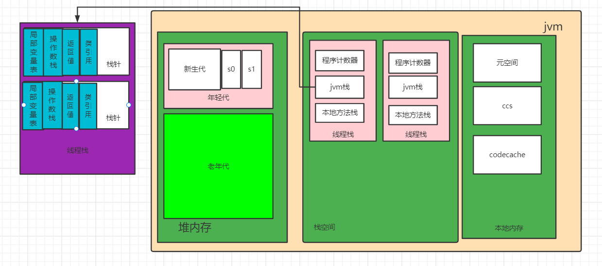

#  作业

##  02（必做）

自定义一个 Classloader，加载一个 Hello.xlass 文件，执行 hello 方法，此文件内容是一个 Hello.class 文件所有字节（x=255-x）处理后的文件。文件群里提供。

解答：https://github.com/Hxhgithub1/javaCourseTask/blob/master/01jvm/XlassLoader.java

##  03（必做）

画一张图，展示 Xmx、Xms、Xmn、Meta、DirectMemory、Xss 这些内存参数的关系。

解答：

- Xmx：代表最大堆内存

- Xms：初始堆内存

- Xmn 设置堆内存中的年轻代的最大值
- Meta 区不属于堆内存, 归属为非堆
- DirectMemory 直接内存, 属于 JVM 内存中开辟出来的本地内存空间。
- Xss设置的是单个线程栈的最大空间;

疑问：个人对在本地内存，元空间，直接内存，ccs,codecache在jvm中的关系理解的不是很清楚，希望助教解答